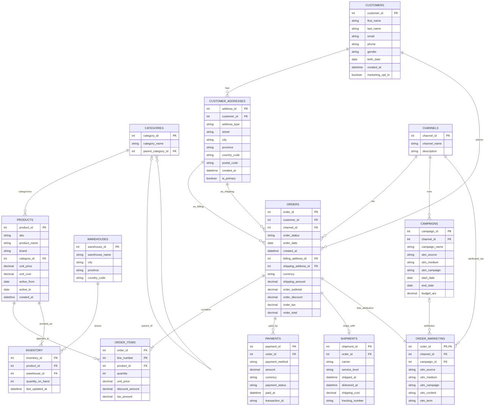

# Lab 1

## Historia (contexto del negocio)

Andina Outdoor es un ecommerce argentino que vende indumentaria y accesorios. Vende por Web, App, Marketplace e Instagram Shop. Opera 2 depósitos (CABA y Córdoba). Corre campañas de performance, retargeting y lanzamientos, con UTM y presupuestos por campaña. El objetivo del lab es tomar estas fuentes normalizadas (raw), construir dimensiones desnormalizadas y hechos para analítica comercial/marketing.

## Tablas y campos

### categories.csv — Catálogo jerárquico de categorías.

#### Campos:

* category_id PK
* category_name nombre
* parent_category_id FK a categoría padre (vacío = raíz)

### products.csv — Maestro de productos.

#### Campos:

* product_id PK
* sku código único
* product_name nombre público
* brand marca
* category_id FK a categories
* unit_price precio lista ARS
* unit_cost costo estimado ARS
* active_from inicio de vigencia
* active_to fin de vigencia (vacío = activo)
* created_at timestamp de alta

### warehouses.csv — Depósitos físicos.

#### Campos:

* warehouse_id PK
* warehouse_name
* city
* province
* country_code

### inventory.csv — Stock actual por depósito y producto.

#### Campos:

* inventory_id PK
* product_id FK
* warehouse_id FK
* quantity_on_hand
* last_updated_at

### customers.csv — Maestro de clientes.

#### Campos:

* customer_id PK
* first_name, last_name
* email, phone
* gender (F/M/X)
* birth_date
* created_at alta del cliente
* marketing_opt_in (true/false)

### customer_addresses.csv — Direcciones normalizadas del cliente.

#### Campos:

* address_id PK
* customer_id FK
* address_type (shipping/billing)
* street, city, province, country_code, postal_code
* created_at
* is_primary (true/false)

### channels.csv — Canales de venta.

#### Campos:

* channel_id PK
* channel_name
* description

### campaigns.csv — Campañas de marketing con UTM y presupuesto.

#### Campos:

* campaign_id PK, channel_id FK
* campaign_name
* utm_source, utm_medium, utm_campaign
* start_date, end_date
* budget_ars presupuesto ARS

### orders.csv — Cabecera de pedido.

#### Campos:

* order_id PK, customer_id FK, channel_id FK
* order_status (created/pending/paid/shipped/delivered/canceled)
* order_date, created_at
* billing_address_id FK, shipping_address_id FK
* currency
* Finanzas snapshot: shipping_amount, order_subtotal, order_discount, order_tax, order_total

### order_items.csv — Ítems del pedido (detalle).

#### Campos:

* order_id FK, line_number PK compuesto
* product_id FK
* quantity
* unit_price precio aplicado
* discount_amount descuento línea
* tax_amount IVA línea

### payments.csv — Pagos asociados al pedido (1..N).

#### Campos:

* payment_id PK, order_id FK
* payment_method (credit_card/debit_card/mercado_pago/bank_transfer/gift_card)
* amount, currency
* payment_status (authorized/captured/refunded)
* paid_at (vacío si autorizado)
* transaction_id

### shipments.csv — Envíos (0..1 por pedido en este dataset).

#### Campos:

* shipment_id PK, order_id FK
* carrier (Andreani/Correo Argentino/OCA), service_level (Estándar/Express)
* shipped_at, delivered_at (vacío si aún no)
* shipping_cost, tracking_number

### order_marketing.csv — Atribución de marketing por pedido (UTM/campaña).

#### Campos:

* order_id FK
* channel_id FK (consistente con orders)
* campaign_id FK (vacío si orgánico/directo)
* utm_source, utm_medium, utm_campaign, utm_content, utm_term

## Relaciones

* categories.category_id → products.category_id
* products.product_id → order_items.product_id, inventory.product_id
* warehouses.warehouse_id → inventory.warehouse_id
* customers.customer_id → customer_addresses.customer_id, orders.customer_id
* customer_addresses.address_id → orders.billing_address_id / orders.shipping_address_id
* channels.channel_id → orders.channel_id, campaigns.channel_id, order_marketing.channel_id
* campaigns.campaign_id → order_marketing.campaign_id
* orders.order_id → order_items.order_id, payments.order_id, shipments.order_id, order_marketing.order_id

## Cardinalidades principales:

customers 1–N customer_addresses | customers 1–N orders | orders 1–N order_items | orders 1–N payments | orders 0–1 shipments | products 1–N order_items | channels 1–N orders | channels 1–N campaigns | campaigns 0–N order_marketing.
